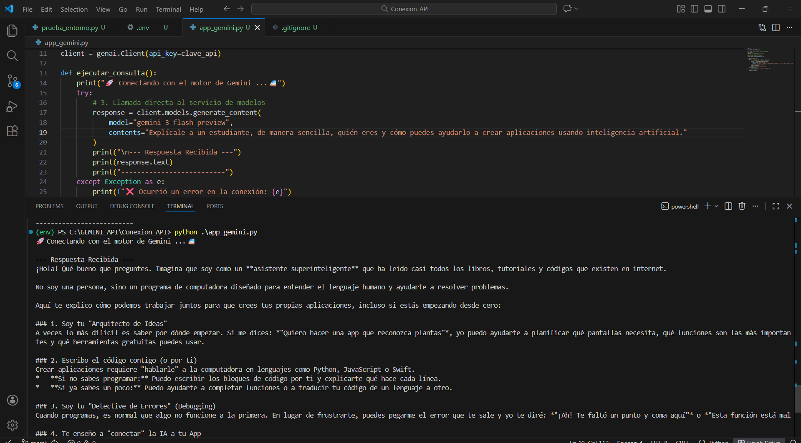

# Conexión a la API de Gemini con Python

Este proyecto demuestra la conexión a la API de Google Gemini usando Python.

## Requisitos
- Python 3.10+
- pip
- API Key de Gemini

## Instalación

1. Clonar repositorio

git clone <https://github.com/linaasco/Conexion_API.git>

2. Crear entorno virtual

python -m venv env

3. Activar entorno

Windows:
env\Scripts\activate

4. Instalar dependencias

pip install -r requirements.txt

5. Crear archivo .env

GEMINI_API_KEY=TU_API_KEY

6. Ejecutar script

python app_gemini.py

## Evidencia de ejecución

